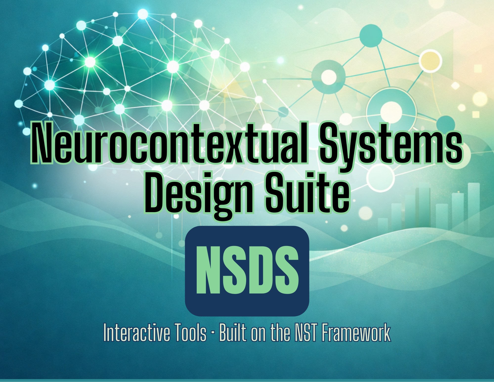

 

**Interactive psychoeducation tools, games, and clinical resources**  
built on the [Neurocontextual Systems Therapy (NST)](https://www.creativesolutionscoaching.com/neurocontextual-systems-design-suite) framework

---

🌐 **[Launch the NSDS Hub →](https://www.creativesolutionscoaching.com/neurocontextual-systems-design-suite)**

---

## 📖 Table of Contents

- [About the NST Framework](#about-the-nst-framework)
- [What's in This Suite](#whats-in-this-suite)
  - [Interactive Games](#-interactive-games)
  - [Assessment Tools](#-assessment-tools)
- [How to Use](#how-to-use)
- [For Clinicians](#for-clinicians)
- [Copyright & Licensing](#copyright--licensing)

---

## About the NST Framework

**Neurocontextual Systems Therapy (NST)** is a neuroinclusive clinical framework developed by Elizabeth Morrison, MS, LPC. NST integrates nervous system regulation, sensory processing, and contextual systems thinking to support neurodivergent individuals and the systems around them.

The NSDS (Neurocontextual Systems Design Suite) is the applied psychoeducation arm of that framework — a collection of interactive tools and games designed for use in clinical, educational, and organizational settings.

> Learn more at [creativesolutionscoaching.com](https://www.creativesolutionscoaching.com)

---

## What's in This Suite

### 🎮 Interactive Games

These narrative and visual games translate NST concepts into experiential learning. Designed for clients and clinicians alike.

<strong>Inner Airspace</strong> — Desktop &amp; Mobile

An immersive game exploring internal nervous system states and how they map to lived experience. Available in both desktop and mobile-optimized versions.

- `inner-airways-desktop-game.html`
- `inner-airspace-mobile-game.html`

<strong>Load Conditions</strong>

An interactive experience centered on capacity, cognitive load, and the conditions that affect nervous system regulation. Desktop-optimized.

- `load-conditions-desktop.html`

<strong>Rose Garden</strong>

A psychoeducation game built on NST principles. Explores contextual factors and their relationship to wellbeing and regulation.

- `rose-garden.html`

<strong>Central Station</strong></strong>

An interactive metaphor-based tool for exploring how the nervous system routes information and responses.

- `central-station.html`

---

### 📋 Assessment Tools

Clinician-administered and client-facing interactive instruments grounded in the NST framework.

<strong>HOSB Interactive</strong> — Hierarchy of Sensory Burden

An interactive clinical assessment tool for evaluating sensory processing load and burden across domains.

- `HOSB-Interactive-NSDS.html`

<strong>NFMS Interactive</strong> — Neurocontextual Functioning & Masking Scale

An interactive assessment instrument exploring functional masking patterns and neurocontextual adaptation.

- `NFMS-Interactive.html`
- `NFMS_Interactive.html`

---

## How to Use

All tools are browser-based HTML applications — no installation required.

**Live versions** of all tools are accessible through the NSDS Hub:  
🔗 [https://www.creativesolutionscoaching.com/neurocontextual-systems-design-suite](https://www.creativesolutionscoaching.com/neurocontextual-systems-design-suite)

This repository is public for **transparency and deployment purposes only.** See licensing terms below before any use of the source files.

---

## For Clinicians

These tools are designed as clinical adjuncts — not standalone diagnostic instruments. They are intended to be used within a therapeutic relationship by trained clinicians familiar with the NST framework.

Clinician training in NST is available through [Creative Solutions Coaching, PLLC](https://www.creativesolutionscoaching.com).

---

## Copyright & Licensing

© 2026 Elizabeth Morrison, MS, LPC — Creative Solutions Coaching, PLLC. All rights reserved.

This repository is publicly visible **for transparency only.** The following are proprietary intellectual property and may **not** be reproduced, redistributed, adapted, or used without explicit written permission:

- All clinical content and psychoeducation materials
- Assessment instruments and scoring algorithms
- NST framework materials and applied derivatives
- Game narratives, mechanics, and design

**Source code** in this repository is likewise proprietary and is not licensed for reuse, forking, or modification without written authorization.

For licensing inquiries: [contact@creativesolutionscoaching.com](mailto:contact@creativesolutionscoaching.com)

---

Built with intention by [Elizabeth Morrison, MS, LPC](https://www.creativesolutionscoaching.com)  
Creative Solutions Coaching, PLLC · Texas

